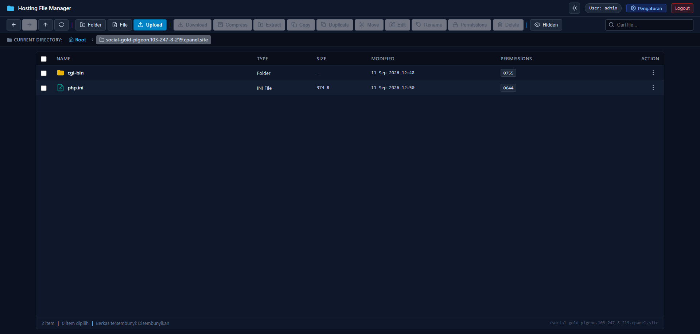

# 📁 Hosting File Manager & ZIP Extractor

[](https://www.php.net/)
[](LICENSE)
[-orange.svg)]()
[](SECURITY.md)
[-blue.svg)](SECURITY.md)
[](../../releases/latest)
[](CONTRIBUTING.md)

**Hosting File Manager** adalah web-based file manager standalone berbasis **PHP Native** yang dirancang khusus untuk mengelola file dan direktori hosting (`public_html`, subdomain, dsb.) langsung dari peramban (browser) tanpa ketergantungan pada cPanel API, database MySQL, ataupun framework eksternal.

Dilengkapi antarmuka modern layaknya cPanel File Manager, kompresi & ekstraksi ZIP tangguh, in-browser Code Editor, **Recycle Bin**, **Activity Log Viewer**, sesi login persisten 30 hari, dan Admin Settings.

<p align="center">
  
</p>

> [!IMPORTANT]
> ### 🛡️ Transparansi Keamanan: 100% Bebas Backdoor & Anti-Pencurian Data
> Mengingat maraknya skrip PHP berbahaya (*web shell / credential stealer*) di internet, kami menjamin secara terbuka dengan transparansi penuh:
> - ❌ **BUKAN Backdoor / Web Shell:** Tidak ada kode tersembunyi, tidak ada teknik pengaburan (*obfuscation*), dan sama sekali **tidak menggunakan fungsi eksekusi berbahaya** seperti `eval()`, `base64_decode()`, `shell_exec()`, atau `system()`.
> - ❌ **TIDAK Mencuri Data / Akun cPanel:** Aplikasi ini **tidak memiliki panggilan keluar (*zero outgoing HTTP / cURL callbacks*)** dan tanpa telemetri. Data berkas dan kredensial Anda 100% tetap berada di server hosting Anda sendiri. Aplikasi ini juga tidak meminta maupun menyentuh akun cPanel/WHM server Anda.
> - ✅ **100% Open Source & Mudah Diaudit:** Seluruh berkas ditulis dalam PHP Native yang bersih, rapi, dan transparan. Siapa pun dapat mengaudit setiap baris kodenya secara mandiri sebelum digunakan di server produksi.
> 
> **🔍 Perintah Audit Mandiri (Buktikan Sendiri):**
> ```bash
> # Pastikan tidak ada fungsi eksekusi berbahaya di seluruh berkas kode:
> grep -rnE "eval\(|shell_exec\(|system\(|passthru\(|base64_decode\(" app/ index.php
> # Hasil: 0 temuan (100% Bersih & Aman)
> ```

---

## 🎯 Untuk Apa Aplikasi Ini? (Fungsi & Skenario Penggunaan)

Banyak yang bertanya: *"Kan di hosting sudah ada cPanel File Manager bawaan, buat apa pakai aplikasi ini lagi?"*

Berikut adalah **kegunaan nyata dan masalah yang diselesaikan** oleh Hosting File Manager:

1. 👥 **Akses File Aman untuk Klien / Tim (Tanpa Kasih Akun cPanel Utama)**  
   Jika Anda seorang *freelancer* atau agensi web, sering kali klien atau anggota tim butuh mengunggah atau mengedit berkas website. Memberikan akun cPanel utama sangat berisiko karena mereka bisa tidak sengaja mengutak-atik database MySQL, setting DNS, atau akun email. Dengan aplikasi ini, Anda cukup memasangnya di subdomain (contoh: `files.domainklien.com`) dengan akses terisolasi hanya pada folder website tersebut.

2. ⚡ **Alternatif Ringan & Cepat Saat cPanel Lemot**  
   cPanel File Manager sering kali terasa berat, waktu muat (*loading*) lambat, atau sesinya cepat kedaluwarsa sendiri saat Anda sedang asyik bekerja. Hosting File Manager berbasis **100% PHP Native murni tanpa database**, sehingga sangat ringan, instan dibuka, dan memiliki masa aktif sesi login hingga 30 hari.

3. 🖥️ **Web File Manager untuk VPS / Server Tanpa Control Panel**  
   Jika Anda mengelola VPS (Ubuntu, Debian, AlmaLinux) yang hanya terpasang web server polos (Nginx/Apache) tanpa panel berbayar seperti cPanel/Plesk, mengelola berkas lewat terminal SSH sering kali memakan waktu. Aplikasi ini memberi Anda antarmuka web GUI explorer yang lengkap dan modern secara cuma-cuma.

4. 🔍 **Fitur Produktivitas yang Tidak Ada di cPanel Bawaan**  
   - **Cari Teks di Seluruh Berkas (*Find in Files*):** Cari potongan kode/string di puluhan berkas PHP/HTML/JS sekaligus dengan dukungan *Regex*, dan langsung lompat ke baris kodenya di editor dalam 1-klik.
   - **Tempat Sampah (*Recycle Bin*):** Berkas yang terhapus tidak langsung musnah permanen, melainkan masuk ke Trash dan bisa dikembalikan (*restore*) ke lokasi asalnya.
   - **Log Riwayat Aktivitas (*Activity Log*):** Catatan transparan mengenai kapan dan berkas apa saja yang diunggah, diedit, diekstrak, atau dihapus.
   - **Editor Kode Nyaman di HP:** Dukungan tampilan layar sentuh adaptif dan menu klik-kanan tahan (*long-press*).

5. 🆘 **Akses Darurat Saat cPanel Down / Terblokir**  
   Ketika dashboard cPanel sedang *error*, lisensinya kedaluwarsa, atau port 2083/2082 diblokir oleh firewall jaringan kantor/kampus Anda, Anda tetap dapat mengelola berkas website melalui port standar HTTP/HTTPS (port 80/443).

---

## ✨ Fitur Utama (Key Features)

- **🖥️ Tampilan cPanel-like Modern** — Responsif, dark/light theme, ikon SVG bersih.
- **🌓 Dark / Light Theme Toggle** — 1-klik, tersimpan di localStorage.
- **📊 Disk Usage / Quota Meter** — Indikator real-time kapasitas disk (Hijau/Oranye/Merah).
- **⚡ Zero Dependencies** — 100% PHP Native, tanpa Composer, Node.js, atau database.
- **📦 ZIP Extractor & Compressor** — Anti-Zip Slip, conflict handling (Overwrite/Skip/Rename).
- **🗑️ Recycle Bin / Trash** — Semua delete ke Trash dulu. Restore 1-klik, hapus permanen, kosongkan. Badge counter real-time.
- **📜 Activity Log Viewer** — Riwayat aktivitas lengkap: upload, rename, edit, trash, extract, dll. Filter per jenis aksi & teks. Status badge berwarna.
- **🔍 Find in Files** — Cari teks/kode di seluruh berkas, support Regex, 1-klik lompat ke editor.
- **🌈 In-Browser Code Editor** — Syntax highlighting PHP/JS/HTML/CSS/SQL/Bash, Fullscreen, Word Wrap, Ctrl+S simpan.
- **⌨️ Keyboard Shortcuts** — F2 Rename, Del Hapus, Ctrl+A Select All, Ctrl+F Cari, Ctrl+Shift+F Find in Files.
- **📱 Responsive Mobile** — Kartu grid adaptif, long-press context menu (haptic feedback), toolbar scrollable.
- **📑 1-Click Duplicate** — Gandakan file/folder instan di direktori yang sama.
- **🚀 Upload Berkas Besar (> 100 MB)** — Multi-file, real-time progress bar.
- **🔒 Keamanan Kelas Hosting** — Path Traversal protection, Rate Limiter brute-force, CSRF Token, audit log.
- **⚙️ Admin Settings UI** — Ganti username, password, root dir, batas upload, session timeout dari web.
- **🌐 Deteksi Cerdas Direktori cPanel** — Auto-deteksi folder induk saat dipasang di subdomain.

---

## 📋 Persyaratan Server

| Komponen | Minimum |
|---|---|
| **PHP** | 7.4 / 8.0 / 8.1 / 8.2 / 8.3+ |
| **Ekstensi PHP** | `ext-zip`, `ext-session`, `ext-json` |
| **Web Server** | Apache / LiteSpeed / Nginx / IIS |
| **Database** | ❌ Tidak diperlukan |

---

## 🚀 Panduan Pemasangan (Quick Start)

> ⚠️ **PENTING — Jangan taruh di folder project yang sudah ada!**
>
> File Manager ini menggunakan `index.php` sebagai entry point utama. Jika Anda menaruhnya langsung di `public_html/` yang sudah ada `index.php` (WordPress, Laravel, dll.), file project Anda **akan tertimpa dan rusak**.
>
> ✅ **Selalu pasang di subfolder khusus atau subdomain terpisah** seperti contoh di bawah ini.

---

### 📁 Opsi A: Subfolder di Hosting *(Paling Mudah)*

```
public_html/
├── index.php         ← project utama Anda (TIDAK TERSENTUH)
├── wp-content/       ← contoh: WordPress / Laravel
└── filemanager/      ← ✅ extract Hosting File Manager ke SINI
    ├── index.php
    ├── config.php
    ├── app/
    ├── assets/
    └── storage/
```

**Langkah:**
1. Download **`hosting-file-manager.zip`** dari tab [**Releases**](../../releases/latest)
2. Upload ke hosting (FTP / cPanel File Manager)
3. Extract ke folder `public_html/filemanager/`
4. Buka browser: `https://domainanda.com/filemanager/`
5. Ikuti **Setup Wizard** → buat username & password

> 💡 **Tip keamanan:** Gunakan nama folder yang tidak mudah ditebak, misal `/manage-X9K/` atau `/cpanel-tools/`

---

### 🌐 Opsi B: Subdomain Khusus *(Paling Aman & Profesional)*

```
domainanda.com/           ← project utama Anda (TIDAK TERSENTUH)
manager.domainanda.com/   ← ✅ subdomain khusus untuk File Manager
```

**Langkah di cPanel:**
1. Login cPanel → **Subdomains** → buat subdomain, misal `manager.domainanda.com`
2. Set **Document Root**: `/home/namauser/manager.domainanda.com/`
3. Upload & extract `hosting-file-manager.zip` ke folder document root tersebut
4. Akses: `https://manager.domainanda.com/`
5. Ikuti **Setup Wizard**

**Keunggulan subdomain:**
- ✅ Nol risiko bentrok dengan project lain
- ✅ SSL terpisah
- ✅ Mudah dinonaktifkan kapan saja
- ✅ URL yang mudah diingat

---

### 🖥️ Opsi C: Lokal XAMPP / Laragon *(Development)*

```
C:\xampp\htdocs\
├── myproject\        ← project Anda
└── filemanager\      ← ✅ extract di sini
```

Akses: `http://localhost/filemanager/`

---

### ⚡ Opsi D: Git Clone *(Developer)*

```bash
git clone https://github.com/kazuhamoe/Hosting-File-Manager.git filemanager
# Akses: http://localhost/filemanager/
```

---

## 🔑 Autentikasi & Keamanan

File Manager menerapkan **First-Time Setup Wizard**:
- Saat pertama dibuka, langsung ke form *Setup Administrator* untuk buat akun
- Password di-hash dengan **Bcrypt** (`PASSWORD_BCRYPT`), disimpan di `storage/credentials.json`
- **Anti Re-Setup** — dikunci permanen setelah akun dibuat
- Rate Limiter proteksi brute-force login
- CSRF Token di semua operasi write

---

## ⚙️ Konfigurasi (`config.php`)

```php
define('ALLOWED_ROOT', dirname(__DIR__));    // Batas direktori yang boleh diakses
define('SESSION_TIMEOUT', 2592000);          // Masa sesi (detik) — default 30 hari
define('MAX_UPLOAD_SIZE', 200 * 1024 * 1024); // Batas upload (200 MB)
define('SHOW_DISK_USAGE', false);            // Tampilkan quota disk
define('AUTH_PASS_HASH', '');                // Kosong = aktifkan Setup Wizard
```

> 💡 Pengaturan via UI web disimpan ke `storage/settings.json` — tidak akan hilang saat update.

---

## 📂 Struktur Direktori

```
├── app/                  # Logika inti PHP (Auth, FileManager, Security, ZipManager, Logger)
├── assets/
│   ├── css/style.css     # Antarmuka responsif
│   └── js/app.js         # Frontend engine (AJAX, upload, editor, context menu)
├── storage/
│   ├── logs/audit.log    # Catatan audit aktivitas
│   ├── trash/            # 🗑️ Recycle Bin — file terhapus disimpan di sini
│   └── temp/             # File sementara
├── index.php             # Entry point aplikasi
├── config.php            # Konfigurasi utama
└── updater.php           # Script update 1-klik
```

---

## 📦 Riwayat Rilis (Changelog)

### 🎉 v2.0.0 — 12 September 2026
- ✅ **Recycle Bin / Trash** — soft delete, restore 1-klik, badge counter, kosongkan semua
- ✅ **Activity Log Viewer** — riwayat aktivitas, filter teks & aksi, status badge berwarna, hapus log
- ✅ **Mobile UI/UX** — grid card, long-press context menu (haptic), toolbar scrollable, editor fullscreen
- ✅ **Find in Files** — pencarian kode di seluruh berkas, Regex support, lompat ke editor
- ✅ **Keyboard Shortcuts** — F2, Del, Ctrl+A, Ctrl+F, Ctrl+Shift+F, Esc
- ✅ **Config Settings Manager** — semua setting bisa diubah dari UI web
- ✅ **Grid View Mode** — tampilan kartu alternatif selain tabel
- ✅ **Auto Permission 0777** — upload/extract otomatis set permission
- ✅ 75 automated test assertions

### v1.0.0 — Rilis awal
- File manager dasar: upload, download, rename, delete, ZIP, code editor, dark mode

---

## 🤝 Kontribusi

1. **Fork** repositori ini
2. Buat branch fitur (`git checkout -b fitur-baru`)
3. Commit (`git commit -m 'feat: tambah fitur baru'`)
4. Push (`git push origin fitur-baru`)
5. Buat **Pull Request**

---

## 📄 Lisensi

[MIT License](LICENSE) — bebas digunakan, dimodifikasi, dan didistribusikan untuk keperluan pribadi maupun komersial.
